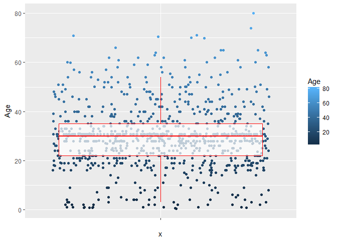
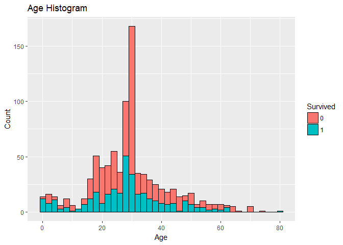
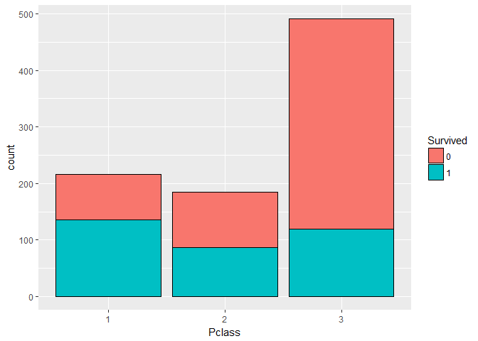
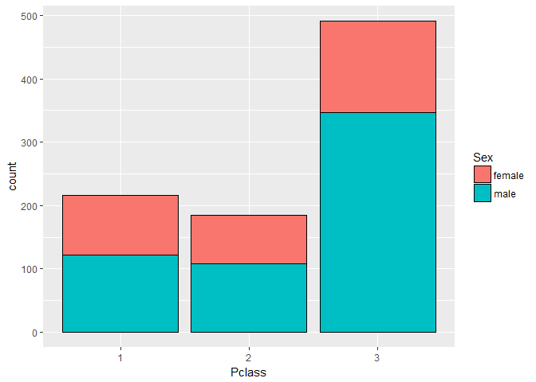

Descriptive Analysis of Titanic dataset
=======================================

This dataset is taken from Kaggle and **ggplot2** package of R is used
to conduct exploratory analysis on the data

    load(file="Titanic_Train.RData")
    library(ggplot2)

Analysis 1: Use Boxplot to analyse distribution of Age
------------------------------------------------------

      ggplot(data = Titanic_Train, aes(x="", y=Age,color=Age)) + 
      geom_jitter()+
      geom_boxplot( alpha = 0.7, color = "Red", outlier.color = NA) 

outlier.color = NA removes the duplicate datapoints shown as a part of
the boxplot which was already covered in jitters

Analysis 2: Use histogram to see frequency disribution of Age
-------------------------------------------------------------

      ggplot(data = Titanic_Train, aes(Age)) + 
      geom_histogram(binwidth = 2, aes(fill = Survived), color="black") +
      geom_text(stat="bin", aes(label = ..count.., size = 3))+
      labs(title = "Age Histogram")+
      labs(x = "Age", y = "Count")

    ## `stat_bin()` using `bins = 30`. Pick better value with `binwidth`.

The age histogtam is bi modal, almost eveyone in the first group age
between 0- 10 survived indicating children were given preferrance, more
people from the age group 20-40 couldnot survive

Analysis 3: Vizualising relation between Gender and Survival
------------------------------------------------------------

      ggplot(data = Titanic_Train, aes(Sex)) + 
      geom_bar(aes(fill = Survived), color="Black") 

More percantage of female passengers survived as compared to male
passenger

Analysis 4: Vizualising relation between travel class and Survival
------------------------------------------------------------------

      ggplot(data = Titanic_Train, aes(Pclass)) + 
      geom_bar(aes(fill = Survived), color="Black")

Analysis 5: Vizualising relation between Embarkment and Survival
----------------------------------------------------------------

      ggplot(data = Titanic_Train, aes(Embarked)) + 
      geom_bar(aes(fill = Survived), color="Black")

Analysis 6: Vizualising relation between gender and travel class
----------------------------------------------------------------

      ggplot(data = Titanic_Train, aes(Pclass)) + 
      geom_bar(aes(fill = Sex), color = "black")

