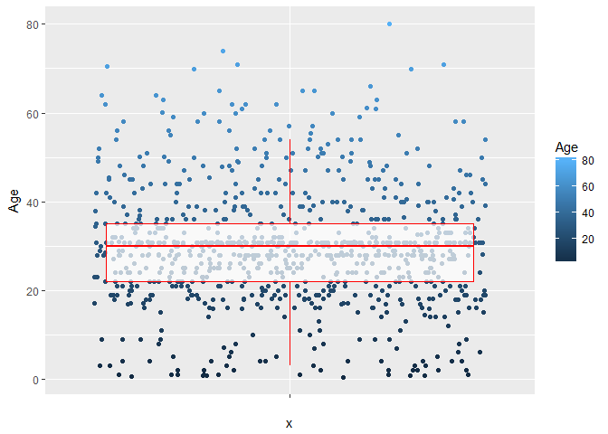
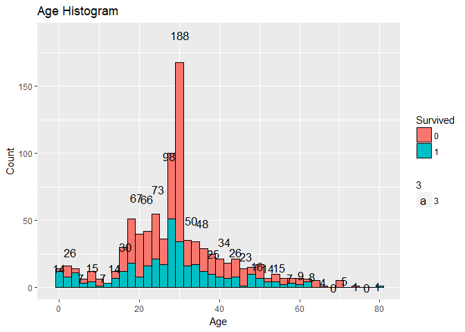
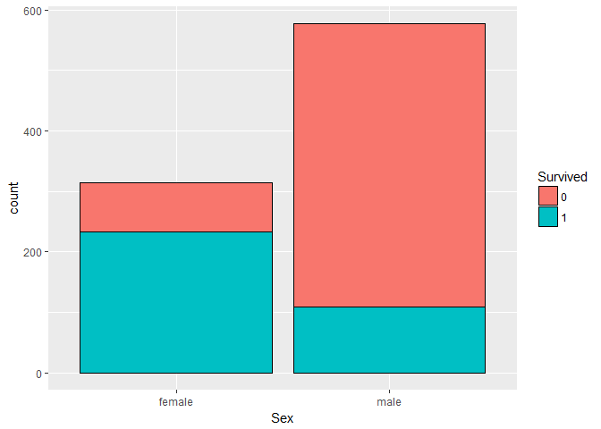
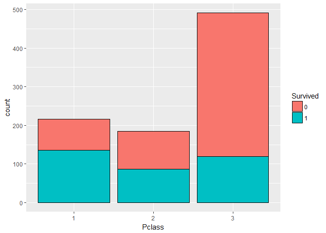
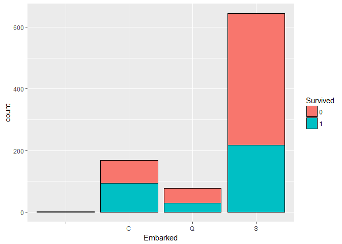
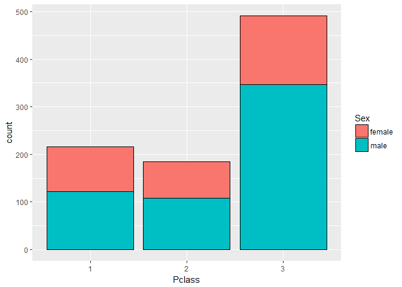

R Markdown
----------

    load(file="Titanic_Train.RData")
    library(ggplot2)
    ggplot(data = Titanic_Train, aes(x="", y=Age,color=Age)) + 
      geom_jitter()+
      geom_boxplot( alpha = 0.7, color = "Red", outlier.color = NA) 

    #outlier.color = NA removes the duplicate datapoints shown as a part of the boxplot which was already covered in jitters

    # Use histogram to see frequency disribution of Age
        ggplot(data = Titanic_Train, aes(Age)) + 
                  geom_histogram(binwidth = 2, aes(fill = Survived), color="black") +
                  geom_text(stat="bin", aes(label = ..count.., size = 3))+
                  labs(title = "Age Histogram")+
                  labs(x = "Age", y = "Count")

    ## `stat_bin()` using `bins = 30`. Pick better value with `binwidth`.

    # conclusion : The age histogtam is bi modal, almost eveyone in the first group age between 0- 10 survived indicating children were given preferrance, more people from the age group 20-40 couldnot survive

    ggplot(data = Titanic_Train, aes(Sex)) + 
                  geom_bar(aes(fill = Survived), color="Black") 

    # result : MOre percantage of female passengers survived as compared to male passenger
    ggplot(data = Titanic_Train, aes(Pclass)) + 
                  geom_bar(aes(fill = Survived), color="Black")

    # to see if there is any pattern in place of embarkment
    ggplot(data = Titanic_Train, aes(Embarked)) + 
                  geom_bar(aes(fill = Survived), color="Black")

    # To see which class which gender travelled?:P
    ggplot(data = Titanic_Train, aes(Pclass)) + 
                  geom_bar(aes(fill = Sex), color = "black")

